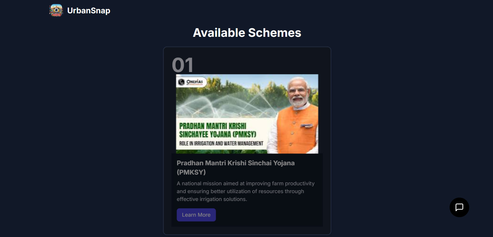
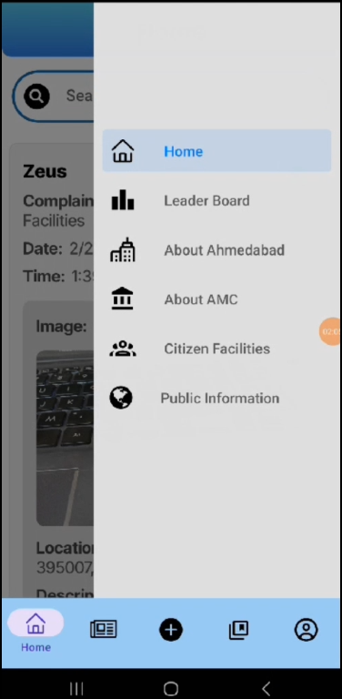

# RRR 8.0
E-governance website

## Introduction to the Project and the Problem Statement
This project aims to enhance civic engagement and streamline the reporting of urban issues through a digital platform. The goal is to provide citizens with an easy way to report problems and access government services, thereby improving the overall quality of urban life.

## Website link 
-[Vercel Deployed Link](https://rrr-8-0-website.vercel.app/)

## Website and App GitHub Repository
- [Main Website Repository](https://github.com/rajatjoe/RRR-8.0-website-)
- [Main App Drive Link](https://drive.google.com/drive/folders/1eKH7nwKsQe4EdeJWCfaqSyulVH5jBUqW?usp=sharing)

## Demo Videos Link for Website and App
- [Website Demo Video](https://rrr-8-0-website.vercel.app/)
- [App Demo Video](https://www.youtube.com/watch?v=GWskDUUN1qI&feature=youtu.be)

## Supporting Github Repositories 
- [Dotslash Model](https://github.com/Rushi-Sh/Dotslash_Model.git)
- [Dotslash Backend](https://github.com/Rushi-Sh/Dotslash_backend.git)
- [RRR 8.0 Website](https://rrr-8-0-website.vercel.app/)
- [RRR 8.0 Website Repository](https://github.com/rajatjoe/RRR-8.0-website-)
- [LeaderBoard](https://github.com/Rishika0812/LeaderBoard)
- [LLM Vision](https://github.com/Rushi-Sh/LLM_Vision.git)

## Explanation of the Tech Stack
The project is built using the following technologies:
- **Frontend**: Next.js, Tailwind CSS , Python, React Native
- **Backend**: Node.js, Express , python  
- **Database**: MongoDB , imgBB
- **Deployment**: Vercel, Render 

## Features That We Provide
- Easy reporting of civic issues
- Real-time tracking of report status
- User-friendly interface
- Notifications for updates on reports
- Reward system for active users
- Integration of AI for automated issue detection 

## Future Scope of Our Project

- Expansion of services to include more government schemes
- Enhanced analytics for better decision-making
- Multi-language support for wider accessibility

## Business Impact
This project aims to foster a more engaged citizenry, improve government responsiveness, and ultimately lead to better urban management. By streamlining communication between citizens and authorities, we can enhance the efficiency of public services and promote a culture of accountability.

## Website Screen Shots 

## App Screen Shots

